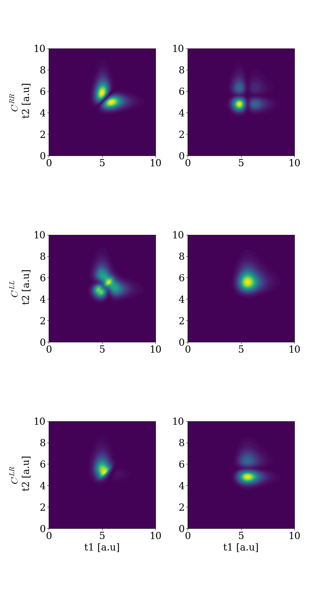

# Multiple Waveguides
In the following, we show that with our framwework we can reproduce the theoretical results obtained in [Le Jeannic, et al. Nat. Phys. 18, 1191–1195 (2022)](https://www.nature.com/articles/s41567-022-01720-x) 


In many of the examples considered so far, we only consider a single waveguide that serves as both input and output, thus only allowing for only one-sided cavities or quantum systems at the end of a waveguide. A more realistic scenario is having a waveguide with a quantum system in the middle. Here an incoming waveguide carying an excitation could scatter on the quantum system and one would have excitations going away from the quantum system in both the first and latter part of the waveguide as illustrated here:^[1]

[^1]: [DynamicalPhotonLodahl2022](@cite)


A way to model this scenario is to have two waveguides: a waveguide to the left and the right, describing the first half of the waveguide and the latter part of the waveguide. For this we use [`WaveguideBasis`](@ref) but with an extra argument specifying that we need 2 waveguides (see [`Two Waveguides`](@ref twowaveguide) for an introduction). We initialize [`WaveguideBasis`](@ref) with two waveguides and a basis for the atom (note that a fockbasis with only one excitation allowed is the same as a two-level-system):

```jldoctest
bw = WaveguideBasis(2,2,times)
be = FockBasis(1)
```

We then define the operators for the interaction between atom and waveguide as (notice the second argument in create(bw,1) that defines which waveguide we are adressing):

```jldoctest
wdLa = create(bw,1) ⊗ destroy(be)
adwL = destroy(bw,1) ⊗ create(be)
wdRa = create(bw,2) ⊗ destroy(be)
adwR = destroy(bw,2) ⊗ create(be)
```

where $\mathrm{wdLa} = w_L ^\dagger a$, $\mathrm{wdRa} = w_R ^\dagger a$, $\mathrm{adwL} = w_L  a^\dagger$, and $\mathrm{adwR} = w_R  a^\dagger$. In this example, we, however, also need an interaction between the waveguides. We therefore we define the creation and annihilation operators 

```jldoctest
wdL = create(bw,1) ⊗ identityoperator(be)
wL = destroy(bw,1) ⊗ identityoperator(be)
wdR = create(bw,2) ⊗ identityoperator(be)
wR = destroy(bw,2) ⊗ identityoperator(be)
```

The interaction should carry over the momentum of the left pulse into the right waveguide and the interaction should therefore model a SWAP gate. This corresponds to $V = \pi /2$ and thus we have the interaction Hamiltonian:

```jldoctest
V = pi/2
H = im*sqrt(κ1/dt)*(adwL-wdLa) + im*sqrt(κ2/dt)*(wdRa-adwR) + V/dt *(wdR*wL + wdL* wR)

```

We can now study how single or two photon states scatter on the atom. We define the initial onephoton or twophoton gaussian state:

```jldoctest
ξ_one_fun(t1,σ,t0) = sqrt(2/σ)* (log(2)/pi)^(1/4)*exp(-2*log(2)*(t1-t0)^2/σ^2)
ξfun(t1,t2,σ1,σ2,t0) = ξ_one_fun(t1,σ1,t0) * ξ_one_fun(t2,σ2,t0) 
w = 1
t0 = 5
psi_in = twophoton(bw,1,ξfun,times,w,w,t0) ⊗ fockstate(be,0)
```

Then solving and viewing the twophoton states in the left,right and twophoton in left and right simultaniously:

```jldoctest
psi_L_scat = TwoPhotonView(psi_out,[:,1],1)
psi_R_scat = TwoPhotonView(psi_out,[:,1],2)
psi_R_L_scat = TwoPhotonView(psi_out,[:,1],2,1)
```



We can also repeat for only a single excitation where we can plot the scattering:


