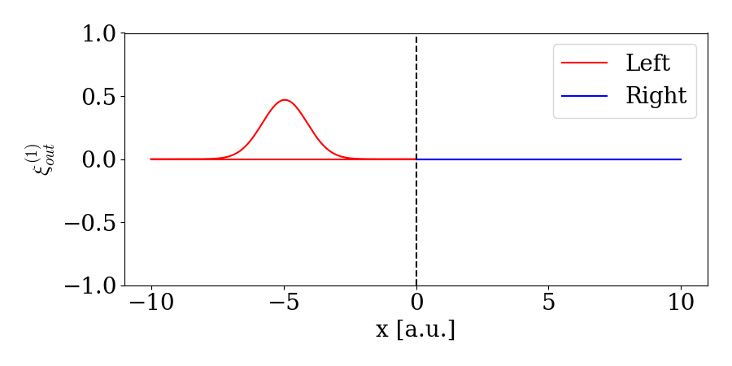

# Multiple waveguides

## [Two Waveguides](@id twowaveguide)
In the previous examples, we have only considered cases with a single waveguide. In this tutorial, we show how to model a beamsplitter and an optical switch using two waveguides. A beamsplitter or a swap gate can be modeled using the Hamiltonian $H_I = V(w_1^\dagger w_2 + w_2^\dagger w_1)$ where V is some interaction strength that determines which interaction is modeled (we will discuss this in detail later). $w_1$ and $w_2$ are the annihilation operators of the two waveguides. A sketch of the system can be seen here:


 We can describe the state of two waveguides with a total of N excitations by adding an argument specifying the number of waveguides as:

```@example multiple
using WaveguideQED #hide
using QuantumOptics #hide
times = 0:0.1:10
dt = times[2] - times[1]
NPhotons = 2
NWaveguides = 2
bw = WaveguideBasis(NPhotons,NWaveguides,times)
nothing #hide
``` 

When creating operators, we now have to specify which waveguide they are acting on (in this case, number one or two). This is done by an extra argument to [`create`](@ref) and [`destroy`](@ref):

```@example multiple
wd1 = create(bw,1)
w1 = destroy(bw,1)
wd2 = create(bw,2) 
w2 = destroy(bw,2)
nothing #hide
``` 

Similarly, initializing one or two-photon states in the first or second waveguide is done by:

```@example multiple
ξ(t,σ,t0) = sqrt(2/σ)* (log(2)/pi)^(1/4)*exp(-2*log(2)*(t-t0)^2/σ^2)
ξ2(t1,t2,σ,t0) = ξ(t1,σ,t0)*ξ(t2,σ,t0)
ψ_single_1 = onephoton(bw,1,ξ,2,5)
ψ_double_1 = twophoton(bw,1,ξ2,2,5)
ψ_single_2 = onephoton(bw,2,ξ,2,5)
ψ_double_2 = twophoton(bw,2,ξ2,2,5)
nothing #hide
``` 

If we want to describe a simultaneous excitation in both waveguides (states like $\ket{1_i}_\mathrm{1}\ket{1_j }_\mathrm{2}$ where the subscript $$\ket{1_i}_\mathrm{i}$ means waveguide i) we specify both indices of the waveguides:

```@example multiple
ψ_single_1_and_2 = twophoton(bw,[1,2],ξ2,2,5)
nothing #hide
``` 

## Beamsplitter through interaction
Let's now treat the same example as in [Interference on Beamsplitter](@ref BStutorial). We consider the two waveguides in an identic single-photon state and thus use the above defined `ψ_single_1_and_2`. The Hamiltonian governing a beamsplitter in the time-binned formalism has $V= \pi/4$:

```@example multiple
V = pi/4
H = im*V/dt*(wd2*w1 - wd1*w2)
nothing #hide
``` 

We can then evolve the system under this Hamiltonian to perform the beam-splitting operation:

```@example multiple
psi_out = waveguide_evolution(times,ψ_single_1_and_2,H)

nothing #hide
``` 

We can then view the final state to verify that we only have two photons in the same waveguide simultaneously:

```@repl multiple
psi_second = TwoPhotonView(psi_out,2);
psi_first = TwoPhotonView(psi_out,1);
psi_first_second = TwoPhotonView(psi_out,[1,2]);
norm(psi_second)^2
norm(psi_first)^2
norm(psi_first_second)^2
``` 

Except for numerical errors, we have 50% chance of observing both photons in the same waveguide and 0 (8.736388404016349e-9)% of observing both photons in each of the waveguides simultaneously. 


Similarly, we can plot the scattering/splitting of a single photon arriving in the left arm. 




## Swap
If we instead choose $V = \pi / 2$, we get the SWAP operation. Let us consider one photon in the first waveguide and swap it to the second waveguide and animate the evolution:

```@example multiple
V = pi/2
H = im*V/dt*(wd2*w1 - wd1*w2)
psi_out_swap = waveguide_evolution(times,ψ_single_1,H)
first_after = OnePhotonView(psi_out_swap,1)
second_after = OnePhotonView(psi_out_swap,2)
nothing #hide
``` 


!!! info "WaveguideBasis(2,2,times) vs. Waveguide $\otimes$ Waveguide"
    Instead of using the custom basis for handling two waveguides, one could instead just do a tensor product between two waveguides basis. This naive approach would look something like:
    
    ```@repl multiple
    times = 0:0.1:10
    bw = WaveguideBasis(2,times)
    Btotal = bw ⊗ bw
    ``` 

    This might work if you only consider single-photon excitations in the waveguides, but if you go consider two-photon excitations (as in the above) the Hilbert space blows up. Indeed, in the above example, the Hilbert space is of size: 27.594.009!!! However, since we often know that the system in total only has two excitations, there is no possibility of having two photons in both waveguides simultaneously (states of type: $\ket{1_k,1_j}_{1}\ket{1_l,1_m}_{2}$). This part of the Hilbert space takes up the majority since it scales as $\propto N^4$ where N is the number of time-bins. Instead, we can exploit that only a total of two excitations is present simultaneously in the system. For this, we use the custom basis [`WaveguideBasis`](@ref) with an additional input stating the number of waveguides:

    ```@repl multiple
    bw = WaveguideBasis(2,2,times)
    ``` 

    The Hilbert space is now of size: 20706. This is still a large Hilbert space, but it is three orders of magnitude smaller than the naive approach as it only scales as $\propto N^2$. 

