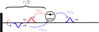
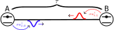
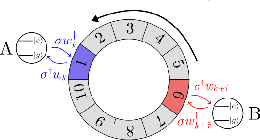
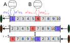

# Non-Markovian dynamics
Non-Markovian dynamics or memory effects can arise in waveguide QED systems when the emitted light is reflected back into the system or when considering two spatially separated emitters. Waveguide systems with memory effects constitute a challenging class of problems because knowledge of the emitted field is inherently required to capture the correct feedback. In the **WaveguideQED** framework, we describe the entirety of the emitted field, which enables a straightforward treatment of memory effects, which we showcase below.


## [Waveguide and Mirror](@id feedback)
As an example of a system with memory effects, we consider a Semi-Infinite Waveguide terminating with a mirror in one end, as also depicted below. The mirror will here introduce a face shift $\phi$, but also an excitation emitted in the left mode will, after a delay time of $\tau/2$, be reflected into the right mode and thus, after a total delay time of $\tau$ hit the emitter again.




The left and right propagating modes are here symmetrical [HughesWQEDMPP2021](@cite), and one can instead think of a single mode wrapping around the emitter. The waveguide is thus a "horseshoe", and the emitter couples to two points of the horseshoe. The two points are here seperated in time ensuring the feedback mechanism. This is also illustrated below.


With this mental picture, there is only one propagating mode, and we describe the interaction through the Hamiltonian [Whalen2019](@cite):

$$\begin{equation}
H_k = \mathrm{e}^{i \phi} \sqrt{\gamma/2\Delta t} \left( \sigma^\dagger w_{k} + \sigma w_{k}^\dagger \right) + \sqrt{\gamma/2\Delta t} \left( \sigma^\dagger w_{k+\tilde{\tau}} + \sigma w_{k+\tilde{\tau}}^\dagger \right)
\end{equation}$$

where $\tilde{\tau} = \tau/\Delta t$ is the index necessary to introduce a time-delay of $\tau$ between the emission and reabsorption. Note that it is the operator $w_{k+\tilde{\tau}}$ that never "sees" the emitted photon again (thus corresponding to the left propagating mode in the first figure, whereas the operator $w_{k}$ experiences the emitted photon from $\tilde{\tau}$ time steps ago (and thus corresponds to the right propagating mode).  $w_{k}^\dagger$ and $w_{k}$ thus carry the phase factor $\mathrm{e}^{i \phi}$ from the mirror.

This type of Hamiltonian is easily described in the **WaveguideQED** framework. We can here create "delayed" operators that address time bins at a delayed time, thus corresponding to $w_{k+\tilde{\tau}}$. This can be done with the keyword `delay` when creating the operator that determines how many bins the delay should be. The value `delay` should therefore be an integer corresponding to $\tilde{\tau} = \tau/\Delta t$. In the following, we define $w_{k+\tilde{\tau}}$ as `w_delayed`:

```@example timedelay
using WaveguideQED #hide
using QuantumOptics #hide
times = 0:0.1:11
dt = times[2]-times[1]
bw = WaveguideBasis(1,times)

delay_time = 1
w_delayed = destroy(bw;delay=delay_time/dt)
wd_delayed = create(bw;delay=delay_time/dt)
nothing #hide
```

The delayed operators are just normal WaveguideOperators addressing different time-bins and can, therefore, effortlessly be combined with the operators of the emitter:

```@example timedelay
be = FockBasis(1)
sdw_delayed = create(be) ⊗ w_delayed
wds_delayed = destroy(be) ⊗ wd_delayed
nothing #hide
```

We can then create the non-delayed operators. We also define the Hamiltonian with a leakage rate of $\gamma = 1$ and a mirror phase of $\pi$:
```@example timedelay
gamma = 1
phi = pi

sdw = create(be) ⊗ destroy(bw)
wds = destroy(be) ⊗ create(bw)

H_pi = exp(im*phi)*sqrt(gamma/2/dt)*(sdw+wds)+sqrt(gamma/2/dt)*(sdw_delayed+wds_delayed)
nothing #hide
```

Considering then how an initially excited emitter population decays, we create the expectation function `ne_exp` returning the emitter population and define the initial state. 

```@example timedelay
sd = create(be) ⊗ identityoperator(bw)
s = destroy(be) ⊗ identityoperator(bw)
n = sd*s
function ne_exp(time,psi)
    expect(n,psi)
end

psi_initial = fockstate(be,1) ⊗ zerophoton(bw)
nothing #hide
```

Finally, we can solve the dynamics of the system and plot them.

```@example timedelay
_,ne_pi = waveguide_evolution(times, psi_initial, H_pi,fout=ne_exp)
nothing #hide
```

```@example timedelay
using PyPlot #hide
fig,ax = subplots(1,1,figsize=(9,4.5))
ax.plot(times,real.(ne_pi),"r-")
ax.set_xlabel(L"time [$1/\gamma$]")
ax.set_ylabel("Population")
plt.tight_layout() #hide
plt.savefig("feedback_pi.svg") #hide
nothing #hide
```


Here, we observe excitation trapping, where destructive interference from the mirror phase, prevents any excitation from going to the right after the initial feedback loop (notice the kink around $t=1$). This is a typical effect observed in these feedback systems, see [HughesWQEDMPP2021](@cite). Note that we observe an artifact in the simulation from $t=10$ to $t=11$ because the delayed operators are trying to address bins in the future which do not exist. To prevent such spurious results from appearing we can instead simulate for a shorter time such that the delay of the operators never exceed the time-bins over which the waveguide basis is defined. We illustrate this in the following by considering a mirror phase of $\phi =0$ and only simulate until $t=10$:

```@example timedelay
phi = 0
H_zero = exp(im*phi)*sqrt(gamma/2/dt)*(sdw+wds)+sqrt(gamma/2/dt)*(sdw_delayed+wds_delayed)

times_sim = 0:0.1:10
_,ne_0 = waveguide_evolution(times_sim, psi_initial, H_zero,fout=ne_exp)
nothing #hide
```

This gives the plot:

```@example timedelay
fig,ax = subplots(1,1,figsize=(9,4.5))
ax.plot(times_sim,real.(ne_pi[1:end-10]),"r-",label=L"$\phi = \pi, \ \ \ \tau= 1$")
ax.plot(times_sim,real.(ne_0),"b-",label=L"$\phi = 0, \ \ \ \tau= 1$")
ax.plot(times_sim,real.(exp.(-times_sim)),"k--",label=L"$\tau= \infty$")
ax.set_xlabel(L"time [$1/\gamma$]")
ax.set_ylabel("Population")
ax.legend()
plt.tight_layout() #hide
plt.savefig("feedback_0.svg") #hide
nothing #hide
```


For comparison, we here also plotteds an exponential decay with the rate $\gamma$ which corresponds to an infinite delay time. We see that for $\phi=0$ we have constructive interference for the excitation going to the right and the population of the emitter decays faster than had there been no feedback.

## [Spatially separated emitters](@id emitters)
Another interesting configuration to investigate is two spatially seperated emitters. If the separation between the emitters $\tau$ is comparable to the emission time $1/\gamma$, then a full description of the waveguide state is necessary. A sketch of the considered system can be seen here:




An emission from emitter A thus arrives at emitter B via the waveguide after $\tau$ time and vice versa. We can represent this in the `Waveguide.jl` formalism as a looped conveyor belt, where the two emitters interact with the waveguide or conveyor belt at two different times/places. This is illustrated below:



We can create such a loop by using delayed operators. This way, the two emitters interact with the same waveguide in different time bins. The waveguide operators, per default, loop around themselves, and thus, by placing the delayed emitter exactly in the middle of the waveguide state, we recreate the loop above. This is also illustrated here:



Here, the looping mechanism is illustrated as "portals" that move the waveguide state's last box to the waveguide's beginning whenever the end is reached due to the progression of time. We thus create a waveguide basis with a length of $2 \tau$ and a set of waveguide operators which are delayed by $\tau$:

```@example twoemitters
using QuantumOptics #hide
using WaveguideQED #hide
using LinearAlgebra #hide
using PyPlot #hide

tau = 10
dt = 0.1
times = 0:dt:2*tau+dt
bw = WaveguideBasis(1, times) #waveguide basis
be = FockBasis(1) #emitter basis

#Defining operators
w = destroy(bw)
wd = create(bw)
w_tau = destroy(bw; delay=tau/dt+1)#Delay of tau
wd_tau = create(bw; delay=tau/dt+1)#Delay of tau
sd = create(be) #Emitter operator
s = destroy(be) #Emitter operator
Iw = identityoperator(bw) #Identityoperator
Ie = identityoperator(be) #Identityoperator
nothing #hide
```

We can then create the Hamiltonian, where emitter A interacts with the not-delayed operators and emitter B with the delayed operators. We also create the expectation value operators here: 

```@example twoemitters
γ = 1
H_e1 = im*sqrt(γ/dt)*(sd⊗Ie⊗w - s⊗Ie⊗wd) 
H_e2 = im*sqrt(γ/dt)*(Ie⊗sd⊗w_tau - Ie⊗s⊗wd_tau) 
H = H_e1 + H_e2

ne_a = (sd*s)⊗Ie⊗Iw
ne_b = Ie⊗(sd*s)⊗Iw
nw = Ie⊗Ie⊗(wd*w)
function expval(time, psi)
  expect(ne_a, psi), expect(ne_b, psi), expect_waveguide(nw, psi)
end
nothing #hide
```

Finally, we can simulate the emission of a photon from emitter A, which, after a delay, impinges on emitter B:

```@example twoemitters
times_sim = 0:dt:2*tau
ψ = fockstate(be, 1) ⊗ fockstate(be, 0) ⊗ zerophoton(bw)
ψ, e1, e2, ew = waveguide_evolution(times_sim, ψ, H, fout=expval)

fig,ax = subplots(1,1,figsize=(9,4.5))
ax.plot(times_sim, abs.(e1), label="Emitter A")
ax.plot(times_sim, abs.(e2), label="Emitter B")
ax.plot(times_sim, abs.(ew), label="Waveguide")
ax.set_xlabel(L"Time [$1/\gamma$]")
ax.set_ylabel("Population")
tight_layout()
ax.legend()
savefig("e1_excited.svg") #hide
```


In the above, we see emitter A decay and emitter B absorps the emitted photon, albeit not entirely. In reality, part of the incoming pulse from emitter A will reflect, and part of it will be absorbed. This means that if we run the simulation for a longer period, we will see emitter A being excited before emitter B is finished emitting. We can show this by extending the simulation time to $6 \tau$:

```@example twoemitters
times_sim = 0:dt:8*tau
ψ = fockstate(be, 1) ⊗ fockstate(be, 0) ⊗ zerophoton(bw)
ψ, e1, e2, ew = waveguide_evolution(times_sim, ψ, H, fout=expval)

fig,ax = subplots(1,1,figsize=(9,4.5))
ax.plot(times_sim, abs.(e1), label="Emitter A")
ax.plot(times_sim, abs.(e2), label="Emitter B")
ax.plot(times_sim, abs.(ew), label="Waveguide")
ax.set_xlabel(L"Time [$1/\gamma$]")
ax.set_ylabel("Expectation Value")
tight_layout()
ax.legend()
savefig("e1_excited_slushing.svg") #hide
```


Here, we see the pulse doing multiple roundtrips, and the excitation of the emitters gets more and more complicated as reflections and reflections of reflections interfere. We see that as more round trips are completed, there is a simultaneous excitation of emitter A and B, indicating the non-trivial nature of the feedback loop. This gets even more complicated if one considers a lifetime of the emitters $1/\gamma$ that is longer than the delay $1/\tau$.


One could also consider both emitters being excited in the beginning. This is done by allowing the waveguide to have two photons in it and changing the initial state. However, if there is no difference between the emitters, we will just see a completely symmetric excitation of them both, as the photons bounce back and forth. In the following, we thus consider two different decay rates of the emitters:

```@example twoemitters
bw = WaveguideBasis(2, times) #waveguide basis with twophotons
be = FockBasis(1) #hide
wd = create(bw) #hide
wd_tau = create(bw; delay=tau/dt+1) #hide
w = destroy(bw) #hide
w_tau = destroy(bw; delay=tau/dt+1) #hide
Iw = identityoperator(bw) #hide
ne_a = (sd*s)⊗Ie⊗Iw #hide
ne_b = Ie⊗(sd*s)⊗Iw #hide
nw = Ie⊗Ie⊗(wd*w) #hide
function expval(time, psi) #hide
  expect(ne_a, psi), expect(ne_b, psi), expect_waveguide(nw, psi) #hide
end #hide

γ = 1
H_e1 = im*sqrt(γ/dt)*(sd⊗Ie⊗w - s⊗Ie⊗wd)
H_e2 = im*sqrt(γ/dt/2)*(Ie⊗sd⊗w_tau - Ie⊗s⊗wd_tau)
H = H_e1 + H_e2


times_sim = 0:dt:6*tau
ψ = fockstate(be, 1) ⊗ fockstate(be, 1) ⊗ zerophoton(bw)
ψ, e1, e2, ew = waveguide_evolution(times_sim, ψ, H, fout=expval)

fig,ax = subplots(1,1,figsize=(9,4.5))
ax.plot(times_sim, abs.(e1), label="Emitter A")
ax.plot(times_sim, abs.(e2), label="Emitter B")
ax.plot(times_sim, abs.(ew), label="Waveguide")
ax.set_xlabel(L"Time [$1/\gamma$]")
ax.set_ylabel("Expectation Value")
tight_layout()
ax.legend()
savefig("both_excited.svg") #hide
```


Here, we see that emitter A, which has a larger decay rate than emitter B, quickly decays so that emitter B is reexcited before it is fully de-excited. Afterward, the evolution quickly grows complicated due to the multiple scattering events. 