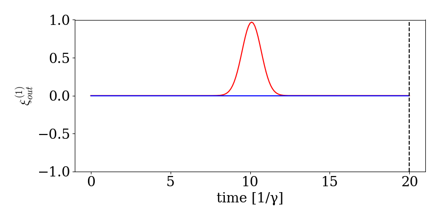

# Toturials
In this section, we show simple examples that illustrate how to use **WaveguideQED.jl** in combination with [`QuantumOptics.jl`](https://qojulia.org/)

## [Combining with QuantumOptics.jl](@id combining)

Basises, states, and operators defined in `WaveguideQED.jl` can be effortlesly combined with operators from [`QuantumOptics.jl`](https://qojulia.org/). As an example, we are going to consider a waveguide with a single photon pulse impinging on an empty onesided cavity. A sketch of the system can be seen here:


We start by defining the basis of the cavity and waveguide:

```@example toturial
using WaveguideQED
using QuantumOptics
times = 0:0.1:10
bw = WaveguideBasis(1,times)
bc = FockBasis(1)
nothing #hide
```

Next we want to create the Hamiltonian for the system. The interaction between the waveguide and cavity is at timestep k given by[^1] $$H_k = i \hbar \sqrt{\gamma / \Delta t}( a^\dagger w_k - a w_k^\dagger)$$, where $$a$$     ($$a^\dagger$$) is the cavity annihilation (creation) operator, $$w_k$$($$w_k^\dagger$$) is the waveguide annihilation (creation) operator, $$\gamma$$ is the leakage rate of the cavity, and `\Delta t = times[2]-times[1]` is the width of the timebin. `WaveguideQED.jl` follows the same syntax as [`QuantumOptics.jl`](https://qojulia.org/) and operators are defined from a basis. Operators of different Hilbert spaces are then combined using ⊗ (``\otimes``):

```@example toturial
a = destroy(bc)
ad = create(bc)
w = destroy(bw)
wd = create(bw)
dt = times[2] - times[1]
γ = 1
H = im*sqrt(γ/dt)*( ad ⊗ w - a ⊗ wd  )
nothing #hide
```

With this we can now simulate the scattering of a single photon with a gaussian wavefunction scattered on a cavity. We define the initial state as waveguide state as:

```@example toturial
ξ(t,σ,t0) = sqrt(2/σ)* (log(2)/pi)^(1/4)*exp(-2*log(2)*(t-t0)^2/σ^2)
σ,t0 = 1,5
ψ_waveguide = onephoton(bw,ξ,times,σ,t0)
nothing #hide
```

Assuming the cavity is empty the combined initial state is then:

```@example toturial
ψ_in = fockstate(bc,0) ⊗ ψ_waveguide
nothing #hide
```

With the initial state we can then call the solver the get the wavefunction after the interaction with the cavity.

```@example toturial
ψ_out = waveguide_evolution(times,ψ_in,H)
nothing #hide
```

Plotting the wavefunction and its norm square gives:

```@example toturial
using PyPlot
viewed_state = OnePhotonView(ψ_out)
fig,ax = subplots(1,2,figsize=(9,4.5))
ax[1].plot(times,viewed_state,"r-")
ax[1].set_xlabel("Time [a.u]")
ax[1].set_ylabel(L"$\xi(t)$")

ax[2].plot(times,abs.(viewed_state).^2,"r-")
ax[2].set_xlabel("Time [a.u]")
ax[2].set_ylabel(L"$|\xi(t)|^2$")
plt.tight_layout()
plt.savefig("scat_onephoton.svg") #hide
nothing #hide
```


We see that the wavefunction has changed after the interaction with the cavity. More specifically we see how the pulse gets absorped into the cavity leading and a corresponding phase change of the wave. This phase change also leads to destructive interference between the photon being emitted from the cavity and the reflection af the incoming photon. This leads to the dip in the photon wavefunction after the interaction.

## Expectation values

In the previous example, only the state at the final timestep was shown. This shows the output wavefunction, but one might also be interested in intermediate states or expectation values. Expectation values can be outputtet from the solver by using the `fout` keyword. As an example, we can get the number of photons in the cavity as a function of time by:

```@example toturial
n = (ad*a) ⊗ identityoperator(bw)
function exp_na(time,psi)
    expect(n,psi)
end
ψ_out,na = waveguide_evolution(times,ψ_in,H,fout=exp_na)
nothing #hide
```

If we also want to know the number of photons in the waveguide state as a function of time another operator to out expectation function as:

```@example toturial
n = (ad*a) ⊗ identityoperator(bw)
n_w = identityoperator(bc) ⊗ (create(bw)*destroy(bw))
function exp_na_and_nw(time,psi)
    (expect(n,psi),expect(n_w,psi))
end
ψ_out,na,nw = waveguide_evolution(times,ψ_in,H,fout=exp_na_and_nw)
nothing #hide
```

Where `expect(n_w,psi)` calculates the expectation value of all times of the pulse at each timestep: $\mathrm{expect(n_w,psi)} = \bra{\psi} \sum_k  I \otimes w_k^\dagger w_k  \ket{psi}$

This can be plottet as:

```@example toturial
fig,ax = subplots(1,1,figsize=(9,4.5))
ax.plot(times,na,"b-",label="na")
ax.plot(times,nw,"r-",label="nw")
ax.plot(times,nw+na,"g-",label="na+nw")
ax.set_xlabel("Time [a.u]")
ax.set_ylabel("Population")
ax.legend()
plt.tight_layout()
plt.savefig("photon_number.svg") #hide
```


Here we see how the photon wavepacket is partially absorped into the cavity and then reemitted again.

If we plot the wavefunction as a function of time (and do some displacing) we can even animate the process:




[^1]: [Heuck2020Photon-photonCavities](@cite)