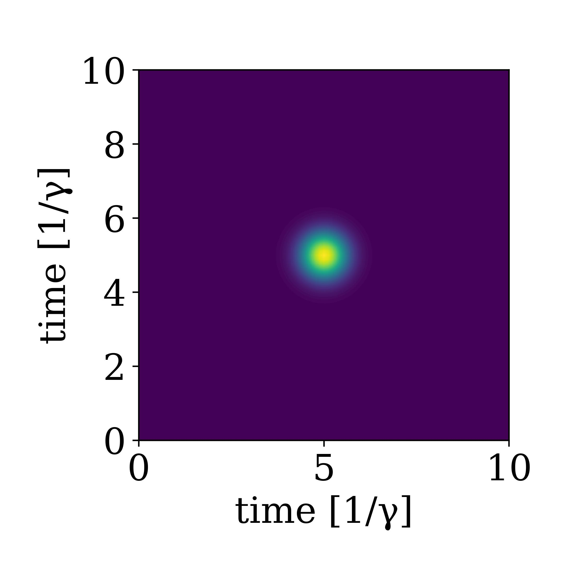

# Continous two photon fock states

So far we have considered only one excitation in the waveguide. We can extend the definition of a one-photon continous fock state to a two-photon state as[^1]:

$$\begin{align*}
\frac{1}{\sqrt{2}}\left[W^\dagger(\xi)\right]^2|0\rangle &= \frac{1}{\sqrt{2}} \int_{t_0}^{t_{end}} d t^{\prime} \int_{t_0}^{t_{end}} d t \ \xi(t) \xi\left(t^{\prime}\right) w^\dagger(t) w^\dagger\left(t^{\prime}\right)|0\rangle \\
 &= \frac{1}{\sqrt{2}} \int_{t_0}^{t_{end}} d t^{\prime} \int_{t_0}^{t_{end}} d t \ \xi^{(2)}(t,t') w^\dagger(t) w^\dagger\left(t^{\prime}\right)|0\rangle  
\end{align*}$$

Here, we here defined the two photon wavefunction $$\xi^{(2)}(t,t') = \xi(t) \xi\left(t^{\prime}\right)$$. The state is now defined over two times, which describes the probability of observing photon A at time $t$ and photon B at time $t'$. In this case, the state is a product state $$\xi^{(2)}(t,t') = \xi(t) \xi\left(t^{\prime}\right)$$, and both probabilities are described by the (same) single photon wavefunction $\xi(t)$, but one could have entangled states across time. This means a non-seperable wavefunction $$\xi^{(2)}(t,t') \neq \xi_1(t)\xi_2(t')$$. For now we will consider a symmetric and seperable state.

The timebinning is in a similar fashion defined as:

$$\begin{align*}
\frac{1}{\sqrt{2}}\left[W^\dagger(\xi)\right]^2|0\rangle &= \frac{1}{\sqrt{2}} \int_{t_0}^{t_{end}} d t^{\prime} \int_{t_0}^{t_{end}} d t \ \xi(t) \xi\left(t^{\prime}\right) w^\dagger(t) w^\dagger\left(t^{\prime}\right)|0\rangle \\
& \rightarrow \frac{1}{\sqrt{2}} \sum_{i=1}^N \sum_{k=1}^N \xi\left(t_i\right) \xi\left(t_k\right) w^\dagger\left(t_i\right) w^{\dagger}\left(t_k\right)|0\rangle \\
& =\frac{1}{\sqrt{2}} \sum_{i=1}^N \sum_{k \neq i}^N \xi\left(t_i\right) \xi\left(t_k\right) w^{\dagger}\left(t_i\right) w^{\dagger}\left(t_k\right)|0\rangle+\sum_{i=1}^N \xi\left(t_i\right) \xi\left(t_i\right)\left|2 t_i\right\rangle \\
& =\frac{2}{\sqrt{2}} \sum_{i=1}^N \sum_{k>i}^N \xi\left(t_i\right) \xi\left(t_k\right)\left|1_{t_i} 1_{t_k}\right\rangle+\sum_{i=1}^N \xi\left(t_i\right) \xi\left(t_i\right)\left|2 t_i\right\rangle \\
& =\sqrt{2} \sum_{i=1}^N \sum_{k > i}^N \xi\left(t_i\right) \xi\left(t_k\right) \mid 1_{t_i} 1_{t_k}\rangle + \sum_{i=1}^N \xi\left(t_i\right) \xi\left(t_i\right)\left|2 t_i\right\rangle
\end{align*}$$


The sum is allowed to run over only half of the times due to the symmetry of the photons (it's equivalent having one photon at time bin k and then one photon at time bin j or one photon at time bin j and then one photon at time bin k). This is how the twophoton state is saved in the underlying arrays and we can define a twophoton basis as and corresponding twophoton state as:

```jldoctest
bw = WaveguideBasis(2,times)
ξ(t,σ,t0) = sqrt(2/σ)* (log(2)/pi)^(1/4)*exp(-2*log(2)*(t-t0)^2/σ^2)
ξ2(t1,t2,σ,t0) = ξ(t1,σ,t0)*ξ(t2,σ,t0)
σ,t0 = 1,5
ψ = twophoton(bw,ξ2,times,σ,t0)
```

Here, we defined the two photon equivalent of our single photon gaussian state. When we visualize it, we now need two times, and we make a contour plot. This is easily done viewing the twophoton state: 

```jldoctest
using PyPlot
viewed_state = TwoPhotonView(ψ)
fig,ax = subplots(1,1,figsize=(4.5,4.5))
plot_twophoton!(ax,viewed_state,times)
ax.set_ylabel("time [1/γ]")
ax.set_xlabel("time [1/γ]") 
plt.tight_layout()
```


## Scattering on a cavity

We now repeat the same setup as in [Combining with QuantumOptics.jl](@ref combining) but instead with a twophoton pulse scattering on the cavity. COMING UP!


[^1]: [Baragiola2012N-PhotonSystem](@cite)
