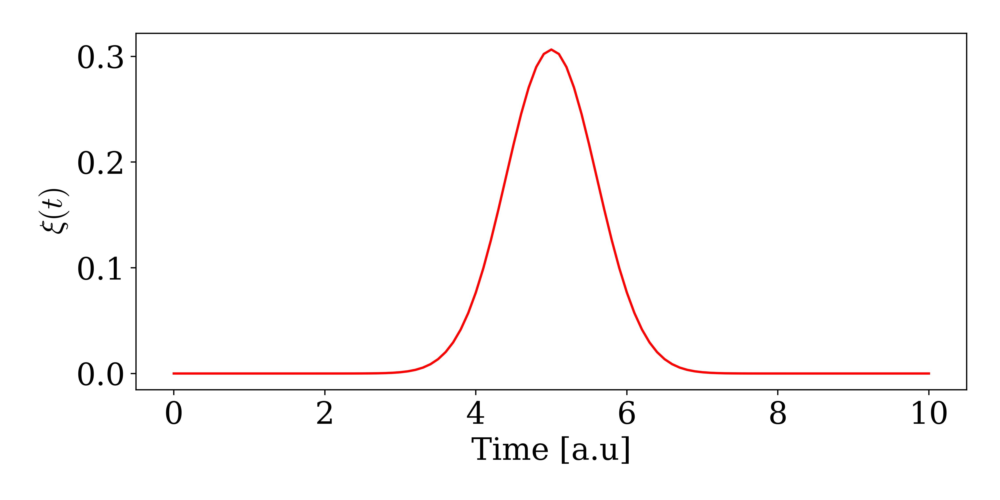

# Continous Fock States

The single photon continuous fock state can be defined as:

$$\begin{equation*}
    \ket{\psi} = W^\dagger(\xi) \ket{0} = \int_{t_0}^{t_{end}} \mathrm{d}t \ \xi(t) w^\dagger(t) \ket{0}
\end{equation*}$$

here $W^\dagger(\xi)$ creates a photon with the wavefunction $\xi(t)$. $w^\dagger(t)$ is the creation operator for a photon at time $t$, and it obeys the commutation relation: $\left[w(t),w(t')\right ] = \delta(t-t')$. The probability of observing a photon at time $t$ is given by: $\bra{0} w(t) \ket{\psi} = |\xi(t)|^2$. The wavefunction $\xi(t)$ thus describes the temporal distribution of the photon.

The heart of the photon time binning is discretizing the continuous fock state into time bins of width $\Delta t$. The interaction with the emitter/cavity will is then assumed to span only one timebin at a time, corresponding to a spectrally flat interaction between the waveguide and emitter/cavity. We thus discretize the annihilation and creation operators by taking[^1]:

$$\begin{equation*}
    w(t_k) = w(k \Delta t) \rightarrow  \frac{w_k}{\sqrt{\Delta t}} \ \ \  \text{with} \ \left[ w_j, w_k^\dagger \right ] = \delta_{jk}
\end{equation*}$$

where $w_k$ is the descritized operator and the factor of $1/\sqrt{\Delta t}$ assures the commutator relation in the limit of $\Delta t \rightarrow 0$. This means that the single photon continuous fock state becomes:

$$\begin{equation*}
    \ket{\psi} = \int_{t_0}^{t_{end}} \mathrm{d}t \ \xi(t) w^\dagger(t) \ket{0} \rightarrow 
\sum_{k=1}^N \sqrt{\Delta t} \xi(t_k) w_k^\dagger \ket{\emptyset}
\end{equation*}$$

In `WaveguideQED.jl`, the timebins above are represented as elements in arrays corresponding to each timebin. Let`s say you want to represent a single photon contionous fock state that starts at $t=0$ and ends at $t=10$ with $\Delta t = 0.1$. This can be done be first creating waveguide basis defined on such a timeinterval:

```jldoctest
using WaveguideQED
times = 0:0.1:10
bw = WaveguideBasis(1,times)
```

Notice that the input for WaveguideBasis is `1` and `times`. `1` denotes the maximum excitation number of fockstates (currently can only be 1 or 2) and `times` the time interval over which the continous fock state is defined. To define the continous fockstate we need to give a wavefuntion $\xi$. In the following we define a gaussian wavefunction located around $t=5$ with a width of $\sigma = 1$:

```jldoctest
ξ(t,σ,t0) = sqrt(2/σ)* (log(2)/pi)^(1/4)*exp(-2*log(2)*(t-t0)^2/σ^2)
σ,t0 = 1,5
ψ = onephoton(bw,ξ,times,σ,t0)
```

This state can be visuallized by:

```jldoctest
using PyPlot
viewed_state = OnePhotonView(ψ)
fig,ax = subplots(1,1,figsize=(9,4.5))
ax.plot(times,viewed_state,"r-")
ax.set_xlabel("Time [a.u]")
ax.set_ylabel(L"$\xi(t)$")
plt.tight_layout()
```


The timebinned creation and annihilation operators are easily created from the basis:

```jldoctest
w = destroy(bw)
wd = create(bw)
```

The timebin that the operator acts on is set by either:

```jldoctest
w.timeindex = 10
wd.timeindex = 10
```
 or:

```jldoctest
set_waveguidetimeindex!(w,10)
set_waveguidetimeindex!(wd,10)
```

The effect of the operator is clear if used on a vacuum state and plot the state we get:

```jldoctest
using PyPlot
ψ = wd*zerohpoton(bw)
viewed_state = OnePhotonView(ψ)
fig,ax = subplots(1,1,figsize=(9,4.5))
ax.plot(times,viewed_state,"r-")
ax.set_xlabel("Time [a.u]")
ax.set_ylabel(L"$\xi(t)$")
plt.tight_layout()
```


We see a spike around `t = times[10] = 0.9` where we now created an excitation. In itself, the waveguide basis, states, and operators are not particularly interesting, but when combined with other quantum mechanical systems such as cavities and emitters the framework can produce powerfull results. See the next example of how to combine with quantum systems defined in ['QuantumOptics.jl'](https://qojulia.org/)


[^1]: [Heuck2020Photon-photonCavities](@cite)